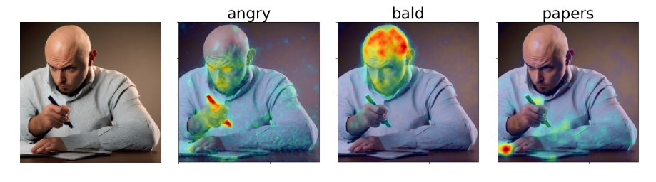

# DAAM-Text2Image: Extension of DAAM for Text-Image Cross-Attention in Diffusion Models

This is an extension for the original DAAM implementation to deal with text-image heatmaps with better control over the diffusion model.



## Getting Started
First, install [PyTorch](https://pytorch.org) for your platform.
Then, install DAAM with `pip install git+https://github.com/RishiDarkDevil/daam-t2i.git`, unless you want an editable version of the library, in which case do `git clone https://github.com/RishiDarkDevil/daam-t2i.git && pip install -e daam`.

### Using DAAM as a Library

Import and use DAAM as follows:

```python
from daamt2i import trace, set_seed
from diffusers import StableDiffusionPipeline
from matplotlib import pyplot as plt
import torch


model_id = 'stabilityai/stable-diffusion-2-base'
device = 'cuda'

pipe = StableDiffusionPipeline.from_pretrained(model_id, use_auth_token=True)
pipe = pipe.to(device)

prompt = 'A dog runs across the field'
gen = set_seed(0)  # for reproducibility

with torch.cuda.amp.autocast(dtype=torch.float16), torch.no_grad():
    with trace(pipe) as tc:
        out = pipe(prompt, num_inference_steps=30, generator=gen)
        heat_map = tc.compute_global_heat_map()
        heat_map = heat_map.compute_word_heat_map('dog')
        heat_map.plot_overlay(out.images[0])
        plt.show()
```

You can also serialize and deserialize the DAAM maps pretty easily:

```python
from daam import GenerationExperiment, trace

with trace(pipe) as tc:
    pipe('A dog and a cat')
    exp = tc.to_experiment('experiment-dir')
    exp.save()  # experiment-dir now contains all the data and heat maps

exp = GenerationExperiment.load('experiment-dir')  # load the experiment
```


## Citation
- For citation to this extension add Link of this project to your work.

### References
- [Original DAAM](https://github.com/castorini/daam)
